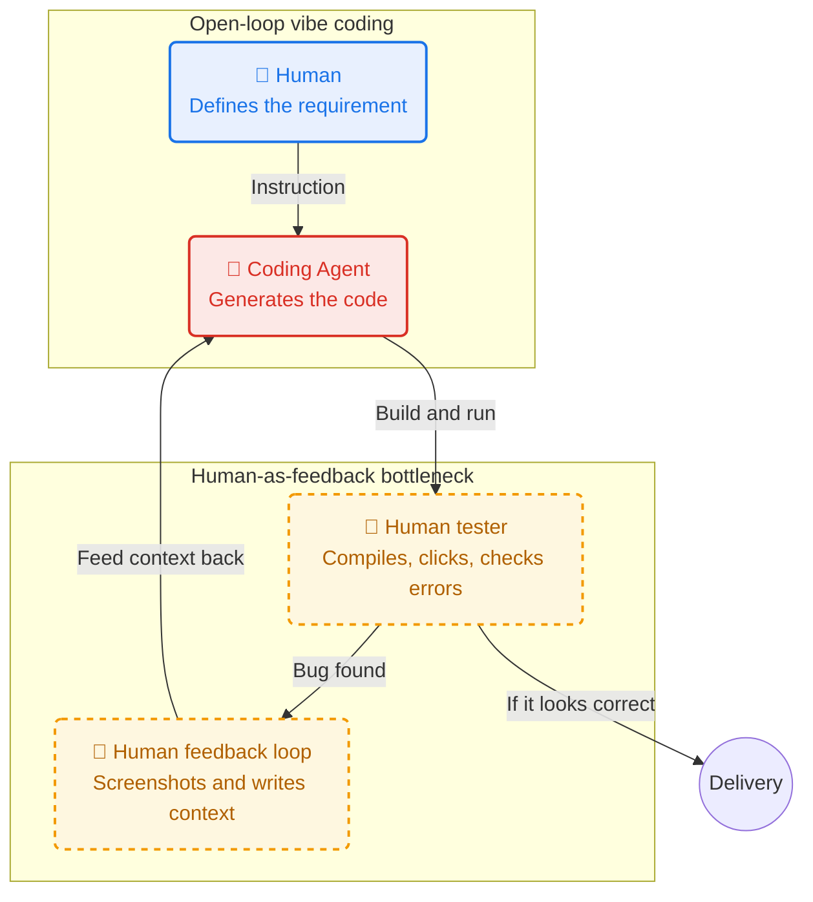
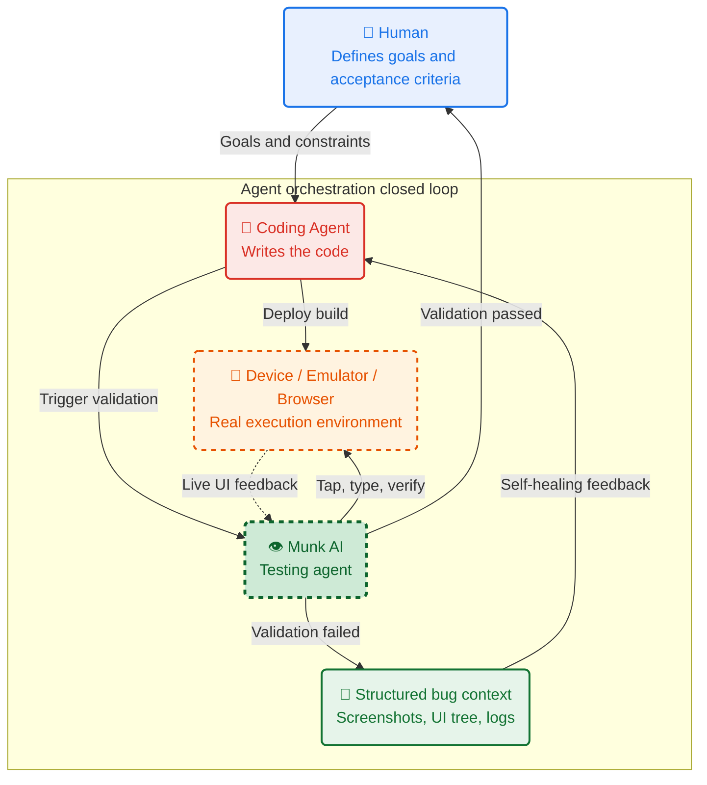
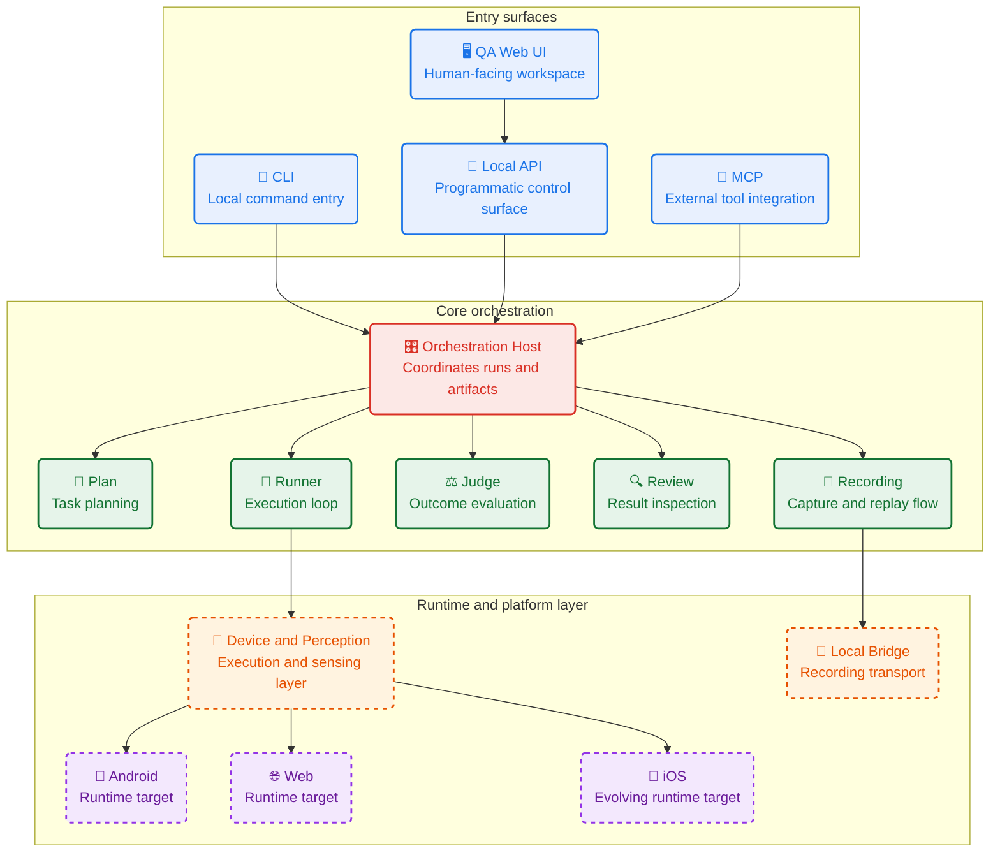

# Munk AI

> AI testing infrastructure for Harness Engineering across Android, iOS, and Web.

Munk AI is local-first AI testing for the AI era.

It brings visual understanding, structured planning, and real-device execution into one validation loop.
Built to give Harness Engineering a real-world feedback loop.

Not another XPath-driven test framework.
Built to turn natural-language intent into product-level validation.

## Demo


*From feature request to real-device validation: Trae + Munk AI implements a new delete flow, builds the project, and verifies the change automatically.*

## Get Started

Available on macOS today.

Install Munk AI, run diagnostics, and start the local Web UI:

```bash
curl -fsSL https://get.munk.sh | sh
munk doctor
munk serve --port 16888
```

For docs and updates, visit [munk.sh](https://www.munk.sh/).

## Why Munk AI

Code generation is no longer the bottleneck.
Verification is.

Most AI workflows still depend on humans to compile builds, click through UIs, inspect failures, take screenshots, and translate bugs back into prompts.

Munk AI closes that loop.
It tests the product itself, not just code, mocks, or static analysis.

- Visual-first validation over fragile selectors and manual click-through testing
- Real Android, iOS, and Web execution instead of mocked or partial feedback
- Structured evidence out: screenshots, UI trees, runtime logs
- Local-first by default: lower cost, tighter privacy, more control
- One engine for developers, QA teams, and coding agents

### The Old Loop: Humans As Test Operators



### The New Loop: Agent Orchestration for Harness Engineering



## What It Does

Plan. Run. Review. Verify.

- Turn natural-language requirements into structured test plans
- Run cross-platform validation on Android, iOS, and Web
- Record interactions and turn them into reusable test assets
- Review code changes and infer regression scope automatically
- Return real UI evidence back into agent workflows

## Tech Stack

### Core Runtime

- Python 3.10
- FastAPI
- Typer CLI
- Pydantic / PydanticAI
- NumPy / OpenCV

### Device Execution

- Android: `uiautomator2`
- Web: `Playwright + Chromium`
- iOS: dedicated runtime integration

### Local UI And Tooling

- Vue 3
- TypeScript
- Vite
- TanStack Query
- vue-i18n

### Bridge Layer

- Node.js
- Fastify
- WebSocket
- scrcpy ecosystem for local Android device streaming and control

## Architecture

Munk AI exposes one validation engine through multiple entry points:

- CLI for local developer workflows
- MCP for coding agents and automation systems
- Local Web UI for QA-oriented device management, test asset management, and batch execution
- Local API for integration with surrounding tools

This design allows the same core engine to serve developers, QA, CI workflows, and AI agents without maintaining separate business logic for each surface.



Repository-level architecture follows a layered, package-oriented model:

- `src/munk/` hosts the main entry surfaces, orchestration, adapters, and artifact handling
- `packages/agents/*` contains agent-facing contract packages and local runtime implementations
- `packages/devices/*` contains cross-platform device contracts and platform-specific runtimes
- `packages/shared/*` contains shared contracts, perception packages, and cross-agent foundations

Platform support should be read as workflow maturity rather than repository presence alone:

- Android is the primary local execution path today
- Web support is available and evolving
- iOS support exists in the repository and continues to evolve

## Current Status

Munk AI is under active development.

- Public repo is live; core modules will be opened in stages.
- App Knowledge support is complete.

## Roadmap

- [x] App Knowledge support
- [x] Polished CLI workflows
- [x] Stable MCP support for coding agents
- [x] Local Web UI for recording, planning, and execution
- [x] macOS release
- [x] Batches mode
- [x] Schedules mode
- [x] Api contract open source
- [x] Implementation open source
- [ ] CI & Release Setup
- [ ] Docs and CONTRIBUTING guide
- [ ] Windows support
- [ ] Linux support
- [ ] iOS environment setup
- [ ] Web environment setup
- [ ] Advanced agent

## Vision

Code gets cheaper.
Verification gets more important.

Munk AI is built for that shift.
The goal is simple: give AI-generated software a real feedback loop.
That is how Harness Engineering becomes practical.

## Contact

- Twitter / X: [@iBoyCoder](https://x.com/iBoyCoder)
- WeChat Official Account: `@朱涛的自习室`

## License

Apache-2.0. See [License.txt](./License.txt).
