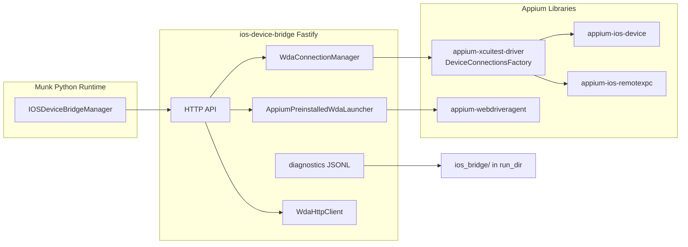

# ios-device-bridge

Munk 的 iOS **真机** sidecar：负责设备发现、WDA 连接/启动、以及 tap / screenshot / app launch 等设备操作。模拟器不走此 sidecar，由 host 侧 `xcrun simctl` 处理。

默认监听 `127.0.0.1:16910`，由 Python runtime 的 `IOSDeviceBridgeManager` 拉起。

## 职责边界

| 能力 | 负责方 |
|------|--------|
| 模拟器发现 / bootstrap | Munk host（`simctl`） |
| 真机发现 | 本 sidecar `GET /devices` |
| 真机 session / WDA 就绪 | 本 sidecar `/sessions` + `/wda/ensure-ready` |
| WDA port forward | **`appium-xcuitest-driver`** `DeviceConnectionsFactory` |
| WDA 进程启动（preinstalled） | **`appium-webdriveragent`** `launchWithPreinstalledWDA` |
| 结构化诊断日志 | 本 sidecar → run artifact `ios_bridge/` |

Python runtime **不应**直接调用 host `devicectl` 做真机发现，也不应再使用旧的 `iproxy` / `go-ios` transport。

## 架构



### WDA 就绪流程（`POST .../wda/ensure-ready`）

1. **`DeviceConnectionsFactory.requestConnection`** — 在 Mac 上监听 `127.0.0.1:8100`，转发到设备 WDA 端口 `8100`（策略由 xcuitest driver 按 iOS 版本 / usbmux 自动选择）。
2. **Probe `/status`** — 若 WDA HTTP 已可达，直接复用，不再 launch。
3. **`launchWithPreinstalledWDA`** — 仅在 probe 失败时，通过 `devicectl` 启动预装的 WDA runner。
4. **`POST /session`** — 创建 WDA session，并带上被测 App 的 `bundle_id`（由 `createSession` 时传入）。

### Port forward 策略（由 xcuitest driver 决定）

| 场景 | 策略 |
|------|------|
| USB 真机，iOS &lt; 18 | legacy usbmux（`appium-ios-device`） |
| USB 真机，iOS 18+ | usbmux（`connectViaUsbmux`，设备在 usbmux 列表中） |
| WiFi-only / 不在 usbmux，iOS 18+ | tunnel registry（需先运行 tunnel-creation，见下文） |

本地与设备端口：

- **Mac 本地监听端口（`localPort`）**：默认尝试 `8100`；若被占用，自动分配 ephemeral 端口（如 `58234`），由 `DeviceConnectionsFactory` 转发到设备。
- **设备 WDA 端口（`remotePort`）**：始终 `8100`（preinstalled WDA 在设备上监听的端口）。

Appium 本身支持 `appium:wdaLocalPort` 自定义本地端口；此前 bridge 写死 `8100` 才会在你已有 WDA/Appium/上次 session 占用时失败。现在 bridge 会对齐该能力。

## Appium 依赖

| 包 | 用途 |
|----|------|
| `appium-xcuitest-driver` | `DeviceConnectionsFactory.requestConnection()` / `releaseConnection()` |
| `appium-webdriveragent` | preinstalled WDA 启动（`usePreinstalledWDA`） |
| `appium-ios-device` | usbmux 设备发现 utilities |
| `appium-ios-remotexpc` | iOS 18+ tunnel 策略（xcuitest driver 内部使用） |

Sidecar **不复制** Appium 内部的 usbmux / tunnel 分支逻辑，只调用 driver 已验证的编排层。

## 前置条件

- macOS + Xcode（含 `xcrun devicectl`）
- 真机已配对、信任此 Mac
- **iOS 17+**（preinstalled WDA 路径；更低版本不在当前支持范围）
- 设备上已安装并信任签名的 **WebDriverAgentRunner**（默认 bundle：`sh.munk.wda.xctrunner`，可通过 session 请求覆盖）
- 运行 case 前设备 **亮屏、解锁**（否则可能出现 UI testing authorization Code=41）
- WiFi-only iOS 18+ 设备：需额外运行 Appium tunnel registry（见 Troubleshooting）

## 开发与构建

```bash
cd sidecars/ios-device-bridge

pnpm install
pnpm run build      # tsc → dist/
pnpm test           # 单元测试
pnpm run dev        # 直接跑 src/app.ts（开发）
pnpm start          # build + fastify dist/app.js
```

Sidecar 源码在仓库 `sidecars/ios-device-bridge/`；distribution runtime 会使用 `dist/runtime-dev/sidecars/ios-device-bridge/` 下的构建产物。修改源码后需重新 `pnpm -r build`（或对应 runtime 组装步骤），再重启 `munk serve`。

环境变量：

| 变量 | 说明 |
|------|------|
| `IOS_BRIDGE_APPIUM_LOG_LEVEL` | Appium driver 日志级别，默认 `info` |

## HTTP API

所有成功响应形如 `{ "ok": true, "data": ... }`；失败为 `{ "ok": false, "error": { "code", "message", "details" } }`。

路由实现：[src/routes/bridge.ts](src/routes/bridge.ts)

### 健康与发现

| 方法 | 路径 | 说明 |
|------|------|------|
| `GET` | `/healthz` | `{ "status": "ok" }` |
| `GET` | `/devices` | 合并 usbmux + `devicectl list devices` 的真机列表 |

`DeviceInfo` 字段：`udid`, `name`, `platform_version`, `state`, `appium_visible`, `backend_kind`（`appium_ios_device` / `appium_ios_remotexpc`）, 可选 `coredevice_identifier`。

### Session

| 方法 | 路径 | 说明 |
|------|------|------|
| `POST` | `/sessions` | 创建 session（尚未连接 WDA） |
| `GET` | `/sessions/:sessionId` | 查询 session 元数据 |
| `DELETE` | `/sessions/:sessionId` | 关闭 session，释放 port forward |
| `GET` | `/sessions/:sessionId/diagnostics` | 诊断快照 + events tail |
| `POST` | `/sessions/:sessionId/wda/ensure-ready` | 建立 port forward、启动/复用 WDA、创建 WDA session |

**`POST /sessions` body：**

```json
{
  "device_udid": "00008101-001C701E0A68001E",
  "bundle_id": "com.example.app",
  "wda_bundle_id": "sh.munk.wda.xctrunner",
  "platform_version": "18.6.2",
  "diagnostics": {
    "operation_id": "op_xxx",
    "run_dir": "/path/to/run",
    "app_id": "com.example.app",
    "plan_id": "plan-xxx",
    "case_id": "case-uuid"
  }
}
```

`diagnostics.run_dir` 若提供，结构化日志写入 `{run_dir}/ios_bridge/`（`session.json`, `events.jsonl`, `summary.json`），并随 run artifact 导出。

### 设备操作（需 WDA ready）

| 方法 | 路径 |
|------|------|
| `POST` | `/sessions/:id/device/screenshot` → `{ png_base64 }` |
| `POST` | `/sessions/:id/device/tap` `{ x, y }` |
| `POST` | `/sessions/:id/device/long-press` `{ x, y, duration_sec? }` |
| `POST` | `/sessions/:id/device/swipe` `{ start_x, start_y, end_x, end_y, duration_sec? }` |
| `POST` | `/sessions/:id/device/type-text` `{ text }` |
| `POST` | `/sessions/:id/device/clear-text` |
| `POST` | `/sessions/:id/device/press` `{ key }`（如 `home`） |
| `POST` | `/sessions/:id/device/dismiss-soft-keyboard` |
| `GET` | `/sessions/:id/device/window-size` |
| `GET` | `/sessions/:id/device/current-app` |
| `GET` | `/sessions/:id/device/accessibility-tree` |

### App 生命周期

| 方法 | 路径 |
|------|------|
| `POST` | `/sessions/:id/apps/launch` `{ bundle_id }` |
| `POST` | `/sessions/:id/apps/terminate` `{ bundle_id }` |

## Munk 集成

- **端口**：`16910`（`IOSDeviceBridgeManager.DEFAULT_IOS_DEVICE_BRIDGE_PORT`）
- **配置**（Web UI Settings / `config.yaml`）：
  - `ios_bridge.sudo_enabled` — 是否用 `sudo` 启动 sidecar
  - `ios_bridge.sudo_password` — `sudo_enabled=true` 时必填
- Python 客户端：[src/munk/services/ios/ios_device_bridge_manager.py](../../src/munk/services/ios/ios_device_bridge_manager.py)

Run 时 diagnostics 上下文由 runtime host 注入，artifact 路径示例：`runs/run_xxx/ios_bridge/summary.json`。

## 手动验证

1. 在 Web UI 保存 iOS bridge 设置（如需 sudo）。
2. 构建 sidecar 并启动 serve：

   ```bash
   pnpm -r build   # 或你的 runtime-dev 组装命令
   ./dist/runtime-dev/bin/munk serve --port 16888
   ```

3. 确认设备列表：

   ```text
   http://127.0.0.1:16888/v1/devices?platform=ios
   ```

4. 跑一条真机 case，检查 run artifact 中 `ios_bridge/`：
   - `wda_session_created: true`
   - `forwarded_port` / `remote_wda_port` 均为 `8100`
   - 无 `wda_tunnel_unavailable`（WiFi-only 场景除外）

## Troubleshooting

| 现象 | 可能原因 | 处理 |
|------|----------|------|
| `wda_tunnel_unavailable` / tunnel registry | WiFi-only iOS 18+，设备不在 usbmux | `sudo appium driver run xcuitest tunnel-creation`，保持进程运行；见 [Appium Remote XPC Tunnels](https://appium.github.io/appium-xcuitest-driver/latest/guides/remotexpc-tunnels-real-devices/) |
| `wda_ui_testing_not_authorized` (Code=41) | 设备锁屏或未授权 UI 测试 | 唤醒并解锁；可手动启动一次 WDA |
| `wda_launch_failed` 60s | WDA 未安装、签名无效、或 port forward 未通 | 检查 WDA 安装与信任；看 `ios_bridge/events.jsonl` 中 `bridge.wda.connection.*` |
| WDA App 在跑但 bridge 仍 launch | 旧版 bridge 误判；现版应先 probe `/status` | 确认已部署含 xcuitest-driver 集成的新 build |
| `EADDRINUSE` 16910 | 上次 serve 未退出 | 结束占用进程或重启 serve |
| `wda_connection_failed` / port #8100 occupied | 本机 8100 被其它进程或陈旧 forwarder 占用 | 新 build 会自动换本地端口；或 `lsof -i :8100` 结束无关进程；重启 `munk serve` 释放 bridge session |

常用错误码：`wda_connection_failed`, `wda_tunnel_unavailable`, `wda_unreachable`, `wda_launch_failed`, `wda_ui_testing_not_authorized`, `session_not_found`.

## 源码结构

```
src/
  app.ts                 Fastify 入口，注册 session manager
  routes/bridge.ts       HTTP 路由
  session_manager.ts     Session 生命周期、设备列表
  session_types.ts       请求/响应类型
  wda_connection.ts      xcuitest DeviceConnectionsFactory 封装
  wda_launcher.ts        preinstalled WDA 启动与复用
  wda_http_client.ts     WDA HTTP（tap、screenshot、/session 等）
  diagnostics.ts         JSONL 诊断与脱敏
  errors.ts              IOSDeviceBridgeError
```

## Legacy 脚本

以下脚本仅用于 **手动** 安装/签名 WDA，不是 runtime 主路径：

- `scripts/device/install_real_device_wda.py`
- `scripts/device/install_wda.py`
- `scripts/device/check_ios_wda_signing.py`
